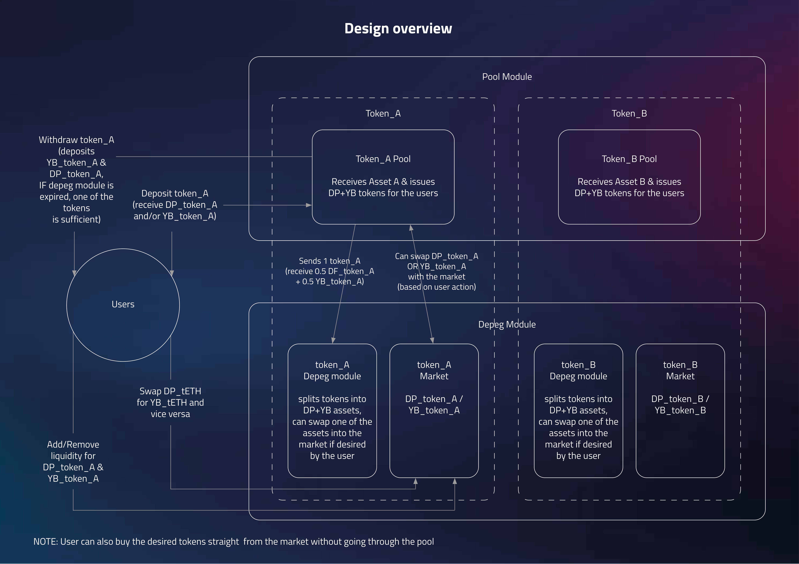
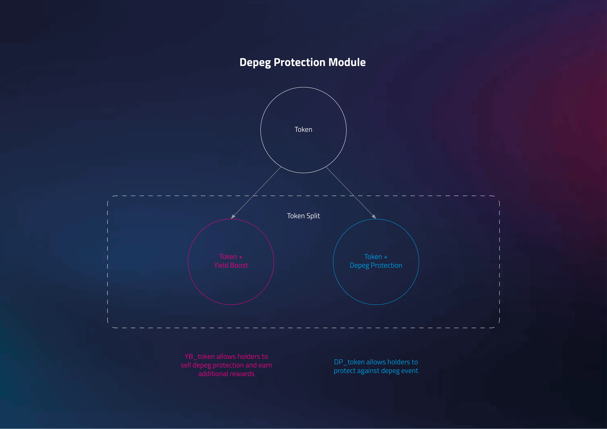

# Tapir protocol litepaper

- [Tapir protocol litepaper](#tapir-protocol-litepaper)
  - [Overview](#overview)
  - [USP - unique selling proposition](#usp---unique-selling-proposition)
  - [High-Level System Design](#high-level-system-design)
  - [Modules](#modules)
    - [Depeg Protection Module](#depeg-protection-module)
      - [What Makes This Depeg Protection Unique?](#what-makes-this-depeg-protection-unique)
      - [Schematic outline](#schematic-outline)
      - [Unlocks](#unlocks)
      - [Example](#example)
        - [With depeg event](#with-depeg-event)
        - [With NO depeg event](#with-no-depeg-event)
      - [User incentives](#user-incentives)
  - [Takeaways](#takeaways)
    - [Why Should Investors Care About Tapir?](#why-should-investors-care-about-tapir)
    - [What Makes Tapir Unique?](#what-makes-tapir-unique)

## Overview

Tapir protocol is a depeg protection marketplace. It allows users to derisk their defi investment or earn additional yield by either buying or selling the depeg protection. 

The pool creates equal quantities of DP and YB tokens from the base asset, then determines their redemption values from oracle-submitted prices when the pool resolves.

## USP - unique selling proposition

No one has been able to offer protection for the high yield assets. 
The protection seller takes the YB side of the pool's resolved depeg allocation, while the protection buyer takes the DP side.

**Investors can buy protection against depegs**  
Tapir allows investors to buy or sell depeg protection against losses caused by events like hacks or slashings. This feature lets some investors earn extra by selling protection, while others sleep easier knowing they are covered. It addresses the challenge of balancing high yields with complex DeFi risks.

**Investors can further boost their yield**  
Beyond benefiting from standard yields, investors can sell depeg protection to earn additional premiums, effectively acting as underwriters. This creates new revenue streams and yield-enhancement opportunities not available in traditional investing methods.

## High-Level System Design

The following schema provides an overview of the system's architecture. Each module is detailed below, outlining its functionality and role within the overall design.

This is a conceptual diagram. In this release, `DepegPool` holds the base asset and
creates DP/YB tokens; `TapirRouter` combines pool calls with the separate AMM.
Expiry first starts COOLDOWN. Single-sided redemption becomes available only after
price submission, cooldown, price aging, and resolution have completed.

## Modules

The repository contains the core pooling module and oracle variants that provide its price inputs.

### Depeg Protection Module

This module enables users to buy or sell protection against depeg events. The pool records a depeg only when its oracle-submitted resolution price is below its high-watermark price by at least the configured formula's 0.1% threshold.

#### What Makes This Depeg Protection Unique?

The module uses the base asset deposited into a DepegPool to mint equal quantities of DP and YB tokens. At resolution, the pool's deterministic formulas allocate redemption value between those tokens; DP value is capped at 200% and YB value can fall to zero.

#### Schematic outline

#### Unlocks

This module unlocks these yield strategies & their combination:

- **derisking investment** by purchasing depeg protection
- **boosting yield** by selling depeg protection and taking on additional risk

#### Example

**Assumption** We assume that the maturity period is **1 year** in this calculation, for sake of greater clarity, however, the actual maturity could be different.

split - 1 token_A => 0.5DP + 0.5YB

- In this step Alice splits token_A into 0.5DP_ token_A and 0.5YB_ token_A
    - derisking investment
        - If she wants depeg protection she will sell the yield boosted part (0.5YB_ token_A) for depeg protected part (DP_ token_A).
        - Let's assume the price for YB_ token_A is 1.02 YB_ token_A/DP_ token_A. Thus by selling 0.5YB_ token_A, she will be able to get 0.49DP_ token_A(0.5/1.02). Thus Alice's initial position of 1 token_A will translate into 0.99DP_ token_A(0.5minted+0.49bought).
    - boosting yield
        - Conversely Bob based on his calculations believes that the risk adjusted return of selling the depeg protection is warranted and he is willing to take the other side of the trade that Alice is making. Thus Bob's initial position of 1 token_A will translate into 1.01YB_ token_A(0.5minted+0.51bought).

##### With depeg event

Let's assume the pool resolves a 5% price decline. The pool calculates `principalDepeggedValue = 9500`, `dpValue = 10526`, and `ybValue = 9474` (all values in basis points). A holder's base-asset redemption is its DP and YB balances multiplied by these values, divided by 10,000, less the pool's redemption fee.

##### With NO depeg event

When no depeg is recorded, `dpValue` and `ybValue` are both 10,000, so each token redeems 1:1 for the base asset before the redemption fee.

#### User incentives

**DP_ token_A buyer** this user seeks the DP side of the pool's final redemption allocation when a depeg is recorded.

**YB_ token_A buyer** this user accepts the YB side of the pool's final redemption allocation, which can be reduced to zero after a sufficiently large depeg.

## Takeaways

### Why Should Investors Care About Tapir?

Tapir provides a time-bounded pool that allocates an oracle-resolved depeg loss between DP and YB holders.

### What Makes Tapir Unique?

The pool mints equal DP and YB token quantities and resolves their redemption values deterministically.
